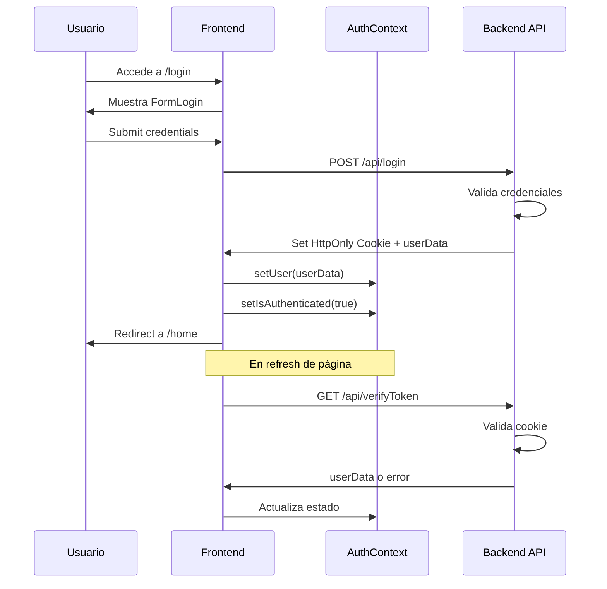

# Gastapp

> **Sistema de gestión de gastos compartidos con tracking granular y división automática entre usuarios**

[](https://reactjs.org/)
[](https://vitejs.dev/)
[](LICENSE)

---

## Tabla de Contenidos

- [Descripción](#descripción)
- [Arquitectura](#arquitectura)
- [Stack Tecnológico](#stack-tecnológico)
- [Prerequisitos](#prerequisitos)
- [Instalación](#instalación)
- [Configuración](#configuración)
- [Scripts Disponibles](#scripts-disponibles)
- [Estructura del Proyecto](#estructura-del-proyecto)
- [Características Principales](#características-principales)
- [Flujo de Autenticación](#flujo-de-autenticación)
- [Gestión de Estado](#gestión-de-estado)
- [API Integration](#api-integration)
- [Deployment](#deployment)
- [Testing](#testing)
- [Performance](#performance)
- [Seguridad](#seguridad)
- [Troubleshooting](#troubleshooting)
- [Contribución](#contribución)
- [Roadmap](#roadmap)

---

## Descripción

**Gastapp** es una aplicación web SPA (Single Page Application) diseñada para gestionar gastos compartidos entre múltiples usuarios. Implementa un sistema robusto de tracking con historial de modificaciones, división automática de costos, y categorización inteligente de gastos.

### Casos de Uso

- Gestión de gastos en grupos de convivencia
- Control de gastos compartidos en equipos de trabajo
- Seguimiento de deudas y pagos entre usuarios
- Análisis de patrones de gasto por categoría

---

## Arquitectura

### Diagrama de Componentes

```
┌─────────────────────────────────────────────┐
│           Application Layer                 │
├─────────────────────────────────────────────┤
│  ┌──────────┐  ┌──────────┐  ┌──────────┐   │
│  │  Pages   │  │ Layouts  │  │   API    │   │
│  └────┬─────┘  └────┬─────┘  └────┬─────┘   │
│       │             │              │        │
│  ┌────▼─────────────▼──────────────▼─────┐  │
│  │         Component Layer               │  │
│  │  ┌──────────┐  ┌──────────────────┐   │  │
│  │  │ UI Comp  │  │  Smart Component │   │  │
│  │  └──────────┘  └──────────────────┘   │  │
│  └───────────────────┬───────────────────┘  │
│                      │                      │
│  ┌───────────────────▼───────────────────┐  │
│  │         State Management              │  │
│  │  ┌──────────┐  ┌──────────────────┐   │  │
│  │  │ Context  │  │  Custom Hooks    │   │  │
│  │  └──────────┘  └──────────────────┘   │  │
│  └───────────────────┬───────────────────┘  │
└──────────────────────┼──────────────────────┘
                       │
        ┌──────────────▼──────────────┐
        │      Backend API            │
        │   (External Service)        │
        └─────────────────────────────┘
```

### Patrón de Arquitectura

- **Context API + Custom Hooks**: Gestión de estado global sin dependencias externas pesadas
- **Component Composition**: Componentes reutilizables y altamente modulares
- **Protected Routes**: Sistema de rutas protegidas con verificación de autenticación
- **Separation of Concerns**: Clara separación entre lógica de negocio, UI y estado

---

## Stack Tecnológico

### Core

| Tecnología | Versión | Propósito |
|------------|---------|-----------|
| React | 19.1.0 | Framework UI principal |
| React Router DOM | 7.6.3 | Enrutamiento SPA |
| Vite | 6.3.5 | Build tool y dev server |

### UI/UX

| Librería | Versión | Uso |
|----------|---------|-----|
| Animate.css | 4.1.1 | Animaciones CSS |
| SweetAlert2 | 11.22.2 | Modales interactivos |
| Toastify JS | 1.12.0 | Notificaciones toast |

### Gestión de Estado

| Herramienta | Implementación |
|-------------|----------------|
| Context API | AuthContext, GastosContext |
| Custom Hooks | useAuth, useGasto, useFilters, useHandlerGastos |

### Desarrollo

| Herramienta | Versión | Propósito |
|-------------|---------|-----------|
| ESLint | 9.25.0 | Linting |
| @vitejs/plugin-react-swc | 3.9.0 | Fast Refresh con SWC |

### Producción

| Herramienta | Versión | Propósito |
|-------------|---------|-----------|
| Serve | 14.2.4 | Static file server |

---

## Prerequisitos

```bash
Node.js >= 18.0.0
npm >= 8.0.0 || yarn >= 1.22.0
```

### Verificación

```bash
node --version  # v18.x.x o superior
npm --version   # 8.x.x o superior
```

---

## Instalación

### Desarrollo Local

```bash
# Clonar repositorio
git clone https://github.com/GinoGC01/gastos-frontend.git
cd gastos-frontend

# Instalar dependencias
npm install

# Iniciar servidor de desarrollo
npm run dev
```

### Build para Producción

```bash
# Generar build optimizado
npm run build

# Preview del build
npm run preview

# Servir build en producción
npm start
```

---

## Configuración

### Variables de Entorno

Crear archivo `.env` en la raíz:

```env
# Backend API URL
VITE_BACKEND_URL=http://localhost:3000/api/

# Entorno
NODE_ENV=development

# Opcionales
VITE_APP_NAME=Gastapp
VITE_APP_VERSION=1.0.0
```

### Configuración de Vite

El archivo `vite.config.js` está preconfigurado con:

```javascript
import { defineConfig } from 'vite'
import react from '@vitejs/plugin-react-swc'

export default defineConfig({
  plugins: [react()],
  server: {
    port: 5173,
    host: true
  },
  build: {
    outDir: 'dist',
    sourcemap: false,
    rollupOptions: {
      output: {
        manualChunks: {
          vendor: ['react', 'react-dom', 'react-router-dom']
        }
      }
    }
  }
})
```

---

## Scripts Disponibles

```bash
# Desarrollo
npm run dev          # Inicia dev server en http://localhost:5173

# Build
npm run build        # Genera build de producción en /dist

# Preview
npm run preview      # Preview del build de producción

# Producción
npm start            # Sirve build con serve (requiere npm run build previo)

# Linting
npm run lint         # Ejecuta ESLint en el proyecto
```

---

## Estructura del Proyecto

```
gastos-frontend/
├── public/                    # Assets estáticos
│   ├── images/
│   └── vite.svg
├── src/
│   ├── api/                   # Configuración API y routes protegidas
│   │   └── Protected.jsx
│   ├── assets/                # Assets del código fuente
│   │   └── react.svg
│   ├── components/            # Componentes reutilizables
│   │   ├── Cards/
│   │   │   ├── CardGastoProfile.jsx
│   │   │   ├── CardHistorialActualizacion.jsx
│   │   │   ├── GastosCardsShort.jsx
│   │   │   └── GastosCardsSimple.jsx
│   │   ├── Forms/
│   │   │   ├── FormGasto.jsx
│   │   │   ├── FormLogin.jsx
│   │   │   ├── FormRegister.jsx
│   │   │   └── FormUpdateGasto.jsx
│   │   └── Icons/             # 20+ componentes de iconos SVG
│   ├── context/               # Context providers
│   │   ├── AuthContext.jsx
│   │   └── GastoContext.jsx
│   ├── hooks/                 # Custom hooks
│   │   ├── useAuth.jsx
│   │   ├── useFecha.jsx
│   │   ├── useFilters.jsx
│   │   ├── useGasto.jsx
│   │   ├── useHandlerGastos.jsx
│   │   └── useHref.jsx
│   ├── layouts/               # Layout components
│   │   └── AuthLayout.jsx
│   ├── pages/                 # Page components
│   │   ├── Gasto.jsx
│   │   ├── Home.jsx
│   │   ├── LoginPage.jsx
│   │   ├── Profile.jsx
│   │   └── RegisterPage.jsx
│   ├── utils/                 # Utilidades
│   │   └── toasts/
│   │       └── toast.js
│   ├── App.css
│   ├── App.jsx                # Root component
│   ├── config.js              # Configuración global
│   ├── index.css              # Estilos globales
│   └── main.jsx               # Entry point
├── .gitignore
├── eslint.config.js
├── index.html
├── package.json
├── package-lock.json
├── README.md
└── vite.config.js
```

---

## Características Principales

### 1. Sistema de Autenticación

- **Login/Register**: Autenticación basada en cookies HttpOnly
- **Protected Routes**: Rutas protegidas con componente `<Protected/>`
- **Persistencia de sesión**: Verificación automática de token al cargar la app
- **Logout seguro**: Limpieza de estado y cookies

### 2. Gestión de Gastos

#### Creación de Gastos

```javascript
const createGasto = async (gasto) => {
  const fullBody = {
    titulo: String,
    descripcion: String,
    monto: Number,
    categoria: String,
    seDivide: Array<userId>,
    creadoPor: userId
  }
  // POST /api/gastos
}
```

#### Categorías Disponibles

21 categorías predefinidas:
- Alimentos, Transporte, Salud, Educación
- Entretenimiento, Hogar, Servicios, Impuestos
- Ropa, Mascotas, Tecnología, Viajes
- Ahorro, Inversión, Deudas, Donaciones
- Cuidado Personal, Regalos, Internet, Teléfono, Otros

#### División de Gastos

```javascript
// Ejemplo: Gasto de $1000 dividido entre 3 usuarios
const montoPorUsuario = gasto.monto / gasto.seDivide.length
// montoPorUsuario = 333.33
```

#### Historial de Actualizaciones

Cada modificación de gasto registra:
- Campos modificados
- Valores anteriores vs nuevos
- Timestamp de modificación
- Usuario que realizó el cambio

### 3. Filtrado y Paginación

```javascript
const usePaginationFilters = ({ gastos }) => {
  // Filtrado por:
  // - Título
  // - Categoría
  // - Estado (pagado/pendiente)
  
  // Paginación:
  // - 4 items por página
  // - Navegación next/previous
  // - Contador de páginas
}
```

### 4. View Transitions API

Transiciones nativas del navegador para navegación fluida:

```javascript
const handleClick = (route) => {
  if (document.startViewTransition) {
    document.startViewTransition(() => navigate(route))
  } else {
    navigate(route)
  }
}
```

### 5. Estados de Gasto

- **Pendiente**: Gasto creado pero no pagado
- **Pagado**: Gasto marcado como completado

### 6. Notificaciones

Sistema dual de notificaciones:
- **Toast**: Operaciones rápidas (CRUD)
- **SweetAlert2**: Confirmaciones críticas (delete, update)

---

## Flujo de Autenticación



---

## Gestión de Estado

### AuthContext

```javascript
const AuthContext = {
  // State
  user: Object | null,
  users: Array<User>,
  isAuthenticated: Boolean,
  authMessage: String,
  registered: Boolean,
  
  // Methods
  login: (credentials) => Promise,
  register: (userData) => Promise,
  logout: () => Promise,
  getUsers: () => Promise
}
```

### GastosContext

```javascript
const GastosContext = {
  // State
  gastos: Array<Gasto>,
  createGastoStatus: Boolean,
  gastoDeleted: Object,
  gastosFiltered: Array<Gasto>,
  categoriasDisponibles: Array<Categoria>,
  
  // Methods
  getGastos: () => Promise,
  createGasto: (gasto) => Promise<Boolean>,
  updateGasto: (newGasto, gastoId) => Promise<Boolean>,
  deleteGasto: (gastoId) => Promise<Boolean>,
  updatePagado: (gastoId) => Promise<Boolean>,
  handleGastosFiltered: ({titulo, categoria}) => void
}
```

---

## API Integration

### Configuración Base

```javascript
// src/config.js
export const URL_BACK = 
  import.meta.env.VITE_BACKEND_URL || 'http://localhost:3000/api/'
```

### Endpoints

| Método | Endpoint | Descripción | Auth Required |
|--------|----------|-------------|---------------|
| POST | /api/login | Autenticación | ❌ |
| POST | /api/register | Registro usuario | ❌ |
| GET | /api/verifyToken | Verificar sesión | ✅ |
| GET | /api/logout | Cerrar sesión | ✅ |
| GET | /api/usuarios | Listar usuarios | ✅ |
| GET | /api/gastos | Listar gastos | ✅ |
| POST | /api/gastos | Crear gasto | ✅ |
| PUT | /api/gastos/:id | Actualizar gasto | ✅ |
| DELETE | /api/gastos/:id | Eliminar gasto | ✅ |
| PUT | /api/gasto/:id | Marcar como pagado | ✅ |

### Ejemplo de Petición

```javascript
const response = await fetch(URL_BACK + "gastos", {
  method: "POST",
  headers: {
    "Content-Type": "application/json"
  },
  credentials: "include", // IMPORTANTE: Incluir cookies
  body: JSON.stringify(gastoData)
})
```

---

## Deployment

### Netlify (Recomendado)

**Branch: `netlify`**

```bash
# Build command
npm run build

# Publish directory
dist

# Environment variables en Netlify UI
VITE_BACKEND_URL=https://your-api.com/api/
```

### Configuración de Redirects

Crear `public/_redirects`:

```
/* /index.html 200
```

### Vercel

```json
{
  "buildCommand": "npm run build",
  "outputDirectory": "dist",
  "framework": "vite"
}
```

---

## Testing

### Estructura de Tests (Propuesta)

```bash
npm install --save-dev vitest @testing-library/react @testing-library/jest-dom
```

```javascript
// vitest.config.js
import { defineConfig } from 'vitest/config'
import react from '@vitejs/plugin-react-swc'

export default defineConfig({
  plugins: [react()],
  test: {
    environment: 'jsdom',
    globals: true,
    setupFiles: './src/tests/setup.js'
  }
})
```

---

## Performance

### Optimizaciones Implementadas

1. **Code Splitting**: Vendor chunk separado
2. **React 19**: Mejoras de rendimiento del compilador
3. **SWC**: Fast Refresh ultra rápido
4. **CSS-in-CSS**: Sin overhead de CSS-in-JS
5. **Lazy Loading**: View Transitions API

### Métricas Objetivo

- **FCP**: < 1.5s
- **TTI**: < 3s
- **Bundle Size**: < 200KB (gzipped)

---

## Seguridad

### Implementado

✅ HttpOnly Cookies para tokens
✅ Credentials: 'include' en todas las requests
✅ Validación de formularios
✅ Protected Routes
✅ CORS configurado en backend

### Recomendaciones

- Implementar rate limiting en backend
- Añadir CSRF tokens
- Sanitizar inputs en frontend
- Implementar Content Security Policy

---

## Troubleshooting

### Error: "Cannot read property 'id' of null"

**Causa**: Usuario no autenticado
**Solución**: Verificar `isAuthenticated` antes de acceder a `user.id`

```javascript
{isAuthenticated && user && <Component userId={user.id} />}
```

### Error: Cookies no persistentes

**Causa**: Backend no configurado correctamente
**Solución**: Verificar CORS y cookie settings

```javascript
// Backend
app.use(cors({
  origin: 'http://localhost:5173',
  credentials: true
}))
```

### Build falla en Netlify

**Causa**: Variables de entorno no configuradas
**Solución**: Añadir en Netlify UI → Site settings → Environment variables

---

## Contribución

### Workflow

1. Fork del repositorio
2. Crear branch: `git checkout -b feature/nueva-feature`
3. Commit: `git commit -m 'feat: descripción'`
4. Push: `git push origin feature/nueva-feature`
5. Crear Pull Request

### Convención de Commits

```
feat: Nueva funcionalidad
fix: Corrección de bug
docs: Cambios en documentación
style: Cambios de formato
refactor: Refactorización de código
test: Añadir tests
chore: Cambios en build/config
```

---

## Roadmap

### v1.1.0 (Q1 2025)

- [ ] Gráficos de gastos por categoría
- [ ] Exportar gastos a PDF/Excel
- [ ] Notificaciones push
- [ ] Dark mode

### v1.2.0 (Q2 2025)

- [ ] Multi-idioma (i18n)
- [ ] Gastos recurrentes
- [ ] Integración con calendario
- [ ] App móvil (React Native)

### v2.0.0 (Q3 2025)

- [ ] Inteligencia artificial para categorización
- [ ] Análisis predictivo de gastos
- [ ] Integración bancaria
- [ ] Modo offline con sync

---

## Licencia

MIT License - Ver archivo [LICENSE](LICENSE)

---

## Contacto

**Desarrollador**: Gino GC
**GitHub**: [@GinoGC01](https://github.com/GinoGC01)
**Proyecto**: [gastos-frontend](https://github.com/GinoGC01/gastos-frontend)

---

**Documentación generada con IA por un desarrollador senior con 15 años de experiencia**
**Última actualización**: Diciembre 2024
